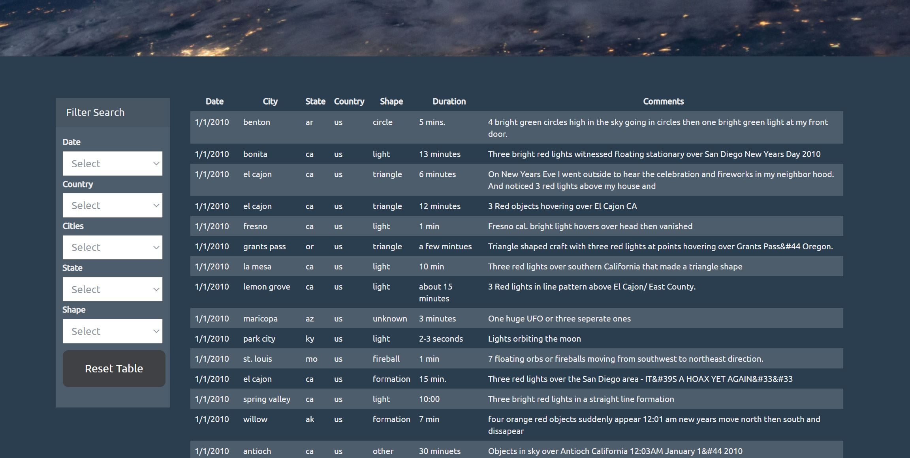

# JavaScript and DOM Manipulation
A webpage was created using JavaScript, HTML, CSS and D3 to display a provided data set of UFO sightings in North America. Note: Further data can be appended or removed from data.js without effecting the site. The data can be filtered down using the dropdown options to display specific UFO sightings. GitHub Pages was then used to create a static site from the repositry. 
Links to the site:

 ### Link to UFO-level-1 site
 https://tomjp90.github.io/javascript-challenge/UFO-level-1/index.html

 ### Link to UFO-level-2 site
 https://tomjp90.github.io/javascript-challenge/UFO-level-2/index.html

### Level 1: Automatic Table and Date Search

* Create a basic HTML web page

* Using the UFO dataset provided in the form of an array of JavaScript objects, write code that appends a table to your web page and then adds new rows of data for each UFO sighting.

  * Make sure you have a column for `date/time`, `city`, `state`, `country`, `shape`, and `comment` at the very least.

* Use a date form in your HTML document and write JavaScript code that will listen for events and search through the `date/time` column to find rows that match user input.

### Level 2: Multiple Search Categories 

* Complete all of Level 1 criteria.

* Using multiple `input` tags and/or select dropdowns, write JavaScript code so the user can to set multiple filters and search for UFO sightings using the following criteria based on the table columns:

  1. `date/time`
  2. `city`
  3. `state`
  4. `country`
  5. `shape`

- - -

